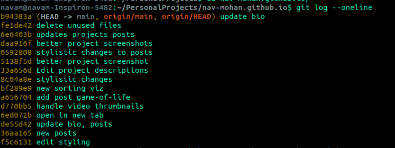

## Question
Given this scenario
```
				   L---M        user2/topic
				  /
		         W---X---Y---Z  user1/topic
                /
   D---E---F---G                master
```
How do we open a pull-request from user2 to user1 and get to the situation below?

```
				   L---M       user2/topic
				  /
		         L---M         user1/topic
                /
   D---E---F---G               master
```


> [!WARNING]  
> Over the course of these steps, you will be affecting your local `topic` branch (on your computer) as well as your remote `topic` branch (on Github). These two branches will be reset back to `master` so, please be careful if there are any valuable changes you'd like to preserve for future references. 
If there are valuable changes on your local branch, `stash` them first by running this command
    ```
    git stash push -m 'valuable-changes-for-future-reference
    ```
    If there are changes on your remote branch you'd like to preserve, then pull them into your local branch and then stash them. 

> [!NOTE]  
> The below instructions are written for `user1`. "You" refers to `user1`. 

### Steps for Accepting Pull-Request
* #### First go to your `topic` branch (if you're not on it already)
    `git checkout topic`

* #### Reset your local `topic` branch back to `master`. 
    Find the nearest common ancestor commit between your `topic` and `master`. In the above diagram, that would commit `G` on `master`. You want to reset your local `topic` branch back to that commit.  
    
    ***WARNING: this will erase all changes to local `topic` branch and reset it back to `master`***
  ```
  git reset --hard <COMMIT_HASH>
  ```
  To find the `<COMMIT_HASH>` of commit `G` run the command `git log --oneline`. This will list out all the commits and their hashes. In the screenshot below, the yellow alphanumeric string are the commit-hash for each commit.
  </img>
    Now, you've reset your local `topic` branch back to `master`

* #### Check the status of your local `topic` branch
    Your local `topic` branch is still tracking your remote `topic` branch (on Github). So, when you check the status of your local branch `topic` by running `git status` it will say something like **"Your branch is 4 commits behind origin"** because your local `topic` branch is in-sync with `master` whereas your remote `topic` branch (on Github) still has those 4 commits (`W`, `X`, `Y`, `Z`) that were committed earlier. 

* #### Reset you remote `topic` branch (on Github) back to `master`
    Now bring your remote `topic` branch (on Github) repo in-sync with your local `topic` branch i.e reset your remote `topic` (on Github) back to `master` by running this command:
    
    ***WARNING: this will reset your remote `topic` branch back to `master`***
    ```
    git push -f origin/topic
    ```
    The `-f` means **"force push"** i.e you want the remote to accept your changes even if there are merge-conflicts

* Now that your remote `topic` branch (on Github) is same as `master`, you can accept the Pull-Request from user2's `topic` to your `topic`
